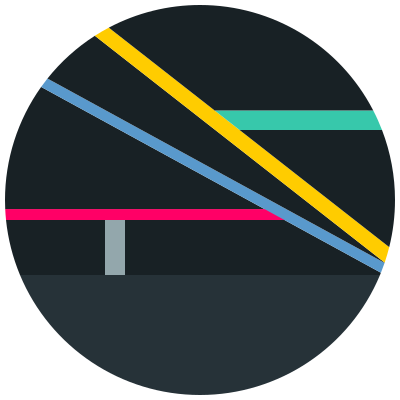
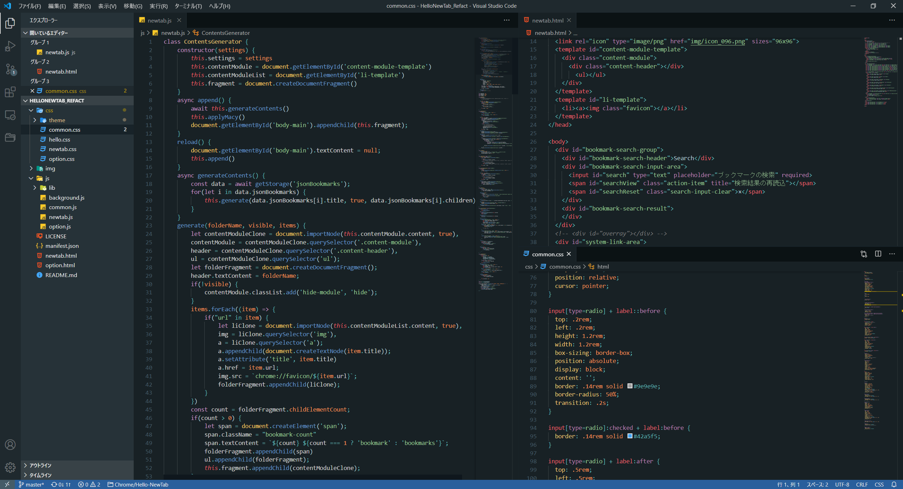

<h1 align="center">
   
    Daybreak Theme
</h1>

Daybreak Theme, the simple dark theme for Visual Studio Code.

<h2>Screenshot</h2>

<h2>Recommended Extension, Fonts</h2>

I highly recommend the following extensions to more beautiful look:
- <a href="https://marketplace.visualstudio.com/items?itemName=PKief.material-icon-theme">Material Icon Theme (Visual Studio Marketplace)</a>

I highly recommend the following fonts:
- <a href="https://github.com/adobe-fonts/source-code-pro">(En) Source Code Pro</a>
- <a href="https://github.com/adobe-fonts/source-han-code-jp">(Ja) Source Han Code (源ノ角ゴシック Code)</a>

## License
MIT License